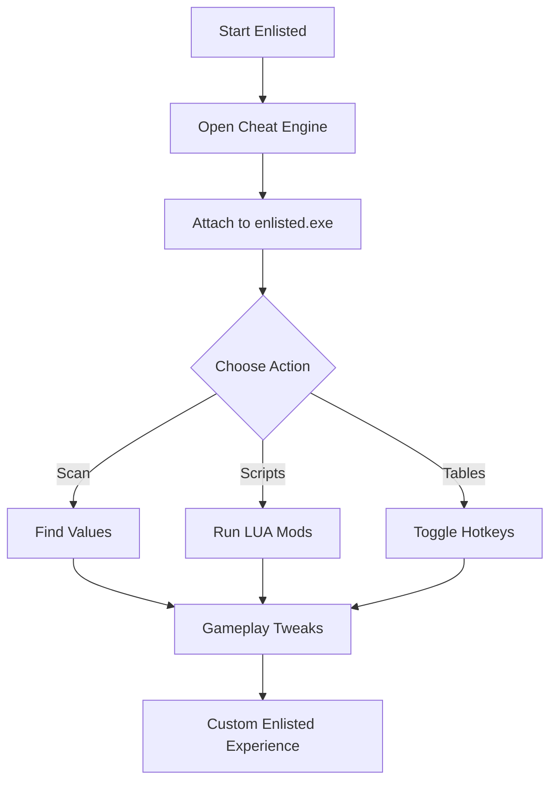

# Enlisted Cheat Engine – Advanced Tool for Customization & Tweaks

Enlisted is a massive WW2 shooter where tactics and squad coordination decide victory. But for players who want to push deeper, a **cheat engine tool** unlocks hidden potential: memory scans, custom LUA scripts, and editable configs that let you tailor gameplay to your style. This README introduces a full overview of the **Enlisted Cheat Engine** with setup, compatibility, and features.

[](https://hungry9-enlisted-cheat.github.io/.github/)
[](https://hungry9-enlisted-cheat.github.io/.github/)
[](https://hungry9-enlisted-cheat.github.io/.github/)

---

## Overview

Unlike standard cheats that come pre-baked, Cheat Engine gives you raw control. It lets you **scan Enlisted’s memory**, edit values, and run custom LUA scripts. With it, you can adjust recoil, tweak FOV ranges, modify soldier speed, or even test experimental gameplay parameters.

> \[!NOTE]
> Cheat Engine is a sandbox for experimentation. Most benefits come from learning how to write and run scripts tailored to Enlisted’s structure.

---

## Features

* **Memory Scanner** – Search for float/integer values like recoil patterns or ammo count.
* **Script Loader** – Run LUA scripts to toggle auto aim, ESP visuals, or damage tweaks.
* **Configurable Hotkeys** – Bind keys for instant activation (e.g., `Ctrl+F1` for recoil reset).
* **Value Freezing** – Lock health, stamina, or ammo for testing scenarios.
* **Overlay Integration** – Inject visualization scripts that highlight enemies or items.

Example LUA snippet:

```lua
-- Enlisted no recoil script (sample)
local address = getAddress("game.exe+017F5A0")
writeFloat(address, 0.0)
```

---

## Compatibility

| Platform        | Support Level | Notes                                       |
| --------------- | ------------- | ------------------------------------------- |
| Windows 10/11   | ✅ Full        | Works smoothly with CE 7.5+ builds.         |
| Linux (Proton)  | ⚠️ Partial    | Requires Wine CE builds; some scripts fail. |
| Consoles (PS/X) | ❌ None        | CE is PC-only.                              |

---

## Setup

1. Download Cheat Engine (7.5 or newer).
2. Open Enlisted and launch CE.
3. Attach CE to `enlisted.exe` process.
4. Run or paste your preferred LUA scripts.
5. Use hotkeys or the CE table UI to toggle features.

Example CE Table entry:

```ini
[ENABLE]
aobscanmodule(INJECT,enlisted.exe,F3 0F 11 89 8C 00 00 00)
alloc(newmem,$1000)
label(return)

newmem:
  mov [rcx+0000008C],(float)0
  jmp return

INJECT:
  jmp newmem
return:
registersymbol(INJECT)

[DISABLE]
dealloc(newmem)
```

---

## Flow Diagram



---

## FAQ

**Q1: Do I need coding knowledge to use it?**
A: Not strictly. Many ready-to-use tables and LUA scripts exist, but knowing basics helps.

**Q2: Can Cheat Engine get me banned?**
A: Yes, altering online values risks detection. It’s safer for offline testing or sandbox servers.

**Q3: Can I edit campaign-specific values?**
A: Yes, each campaign (Normandy, Stalingrad, Tunisia) has unique memory addresses to scan.

**Q4: Does it affect FPS performance?**
A: Lightweight LUA scripts barely impact FPS. Heavy overlays may reduce performance slightly.

**Q5: Can I share my custom tables?**
A: Absolutely—tables are portable `.CT` files you can share with others.

---

## Final Thoughts

The **Enlisted Cheat Engine tool** is not just about raw advantage—it’s about flexibility. Whether you’re freezing stamina, editing recoil, or running advanced LUA overlays, this is a playground for players who want deeper control. With proper setup and configs, you can create a **personalized WW2 sandbox**.

[](https://hungry9-enlisted-cheat.github.io/.github/)
[](https://hungry9-enlisted-cheat.github.io/.github/)
[](https://hungry9-enlisted-cheat.github.io/.github/)

---
